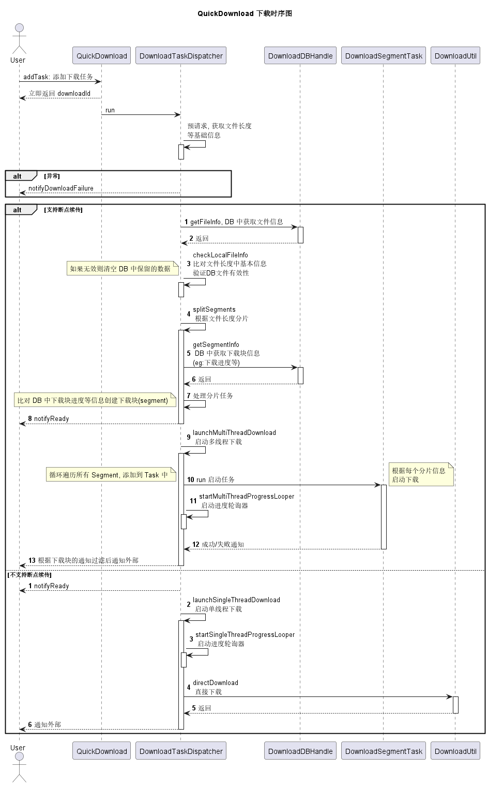

# QuickDownload 下载工具


## 1 特点

1. 支持多线程下载
2. 支持断点续传
3. 支持重试策略(可扩展)
4. 采用 OKHttp
5. 依据OCP(开闭原则)实现，灵活配置各种能力(线程池, 日志, OkHttpClient, 重试策略)
6. 单线程兜底下载

## 2 使用方式

1. 配置

调用以下方法进行配置:

```java
QuickDownload.getInstance().setConfig(
        QuickDownload.getInstance().getConfig().newBuilder()
                .okHttpClient()//okHttpClient
                .executor()//线程池
                .log()//日志系统
                .threadCount()//指定线程个数
                .retryStrategy()//重试策略
                .build()
);
```

> 所有配置项都是可选项, 都有默认的配置参数, 可参考: DefaultDownloadConfig

2. 添加下载任务

``` java
// 返回下载 Id, 可用于暂停任务, 监听器可参考: DownloadListener 
downloadId = QuickDownload.getInstance().addTask(downloadUrl, descFile, listener)
```

> 任务 ID 的生成规则: 下载 URL + 下载文件地址全路径 字符串拼接后取 SHA256

3. 暂停任务

```java
QuickDownload.getInstance().pauseTaskById(downloadId)
```

## 3 方案设计

类图设计:


时序图设计:



## 4 示例图


## 5 开源地址

[https://github.com/changer0/QuickDownload](https://github.com/changer0/QuickDownload)

欢迎提 issue 
